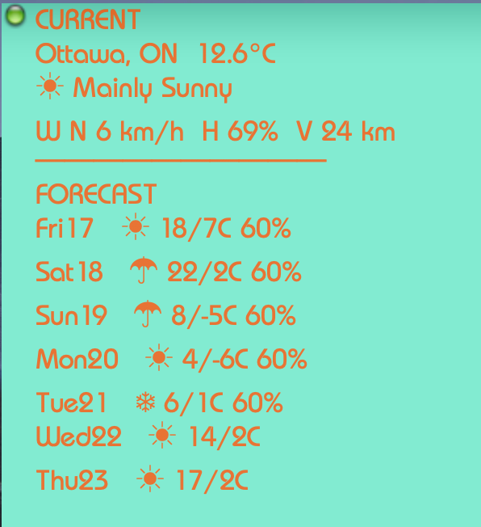

# GeekTool: Environment Canada weather

Small **shell + Python** script for [GeekTool](https://www.tynsoe.org/en/geektool/) on macOS. It fetches a public Environment Canada city page like:

`https://weather.gc.ca/en/location/index.html?coords=45.403,-75.687`

…and prints a compact **CURRENT** + **7-day FORECAST** block suitable for a desktop geeklet.

Data source: [Environment Canada weather](https://weather.gc.ca/) (Government of Canada).

## Preview



## Requirements

- macOS
- **Python 3** available as `python3` (macOS includes this)
- **GeekTool** (or any shell runner that can execute a command on an interval)

No extra Python packages are required (stdlib only).

## Download

### Option A: clone this repo (recommended)

```bash
git clone https://github.com/dmccullo/GeekTool-Environment-Canada-Weather-Geeklet.git
cd GeekTool-Environment-Canada-Weather-Geeklet
```

### Option B: download just the script

Save `Tools/envcan-geektool.sh` anywhere on your Mac (for example `~/Documents/GeekTool/`).

## Install

1. Put the script somewhere permanent (example: `~/Documents/GeekTool/envcan-geektool.sh`).
2. Make it executable:

```bash
chmod +x ~/Documents/GeekTool/envcan-geektool.sh
```

### Optional: keep `~/Documents/GeekTool/` pointed at your git checkout

If you want GeekTool to always run the **exact file from your repo** (great for verifying the “download + run” experience while developing), make the Documents path a symlink:

```bash
mkdir -p ~/Documents/GeekTool
ln -sf "$PWD/Tools/envcan-geektool.sh" ~/Documents/GeekTool/envcan-geektool.sh
chmod +x "$PWD/Tools/envcan-geektool.sh"
```

## Find your coordinates (URL)

1. Open Environment Canada’s site and search your location.
2. When you’re on the forecast page, copy the URL from your browser’s address bar.
   - It will look like:
     - `https://weather.gc.ca/en/location/index.html?coords=LAT,LON`

You can paste that full URL into the script with `--url`, or copy only the `LAT,LON` part for `--coords`.

## GeekTool setup

1. Open GeekTool → **New Geeklet** → **Shell**.
2. Set refresh (example): **30s**.
3. Set the command to one of the examples below.
4. Choose a monospace-friendly font and a geeklet size that avoids wrapping if you want the tightest layout.

### Example: Ottawa (coords)

```bash
/Users/you/Documents/GeekTool/envcan-geektool.sh --coords "45.403,-75.687"
```

### Example: any city (full URL)

```bash
/Users/you/Documents/GeekTool/envcan-geektool.sh --url "https://weather.gc.ca/en/location/index.html?coords=45.403,-75.687"
```

### Fahrenheit toggle

```bash
/Users/you/Documents/GeekTool/envcan-geektool.sh --coords "45.403,-75.687" --fahrenheit
```

Equivalent:

```bash
/Users/you/Documents/GeekTool/envcan-geektool.sh --coords "45.403,-75.687" --units F
```

Celsius (default):

```bash
/Users/you/Documents/GeekTool/envcan-geektool.sh --coords "45.403,-75.687" --units C
```

## Help

```bash
/Users/you/Documents/GeekTool/envcan-geektool.sh --help
```

## Notes / limitations

- This script parses the public HTML page plus embedded JSON fragments. If Environment Canada changes their page structure, the script may need an update.
- Wind/humidity/visibility remain in **metric** units as shown on the Canadian page, even when temperatures are converted to Fahrenheit.

## License

If you publish this on GitHub, add a license file you’re comfortable with (many small utilities use MIT). This README intentionally does not pick a license for you.
